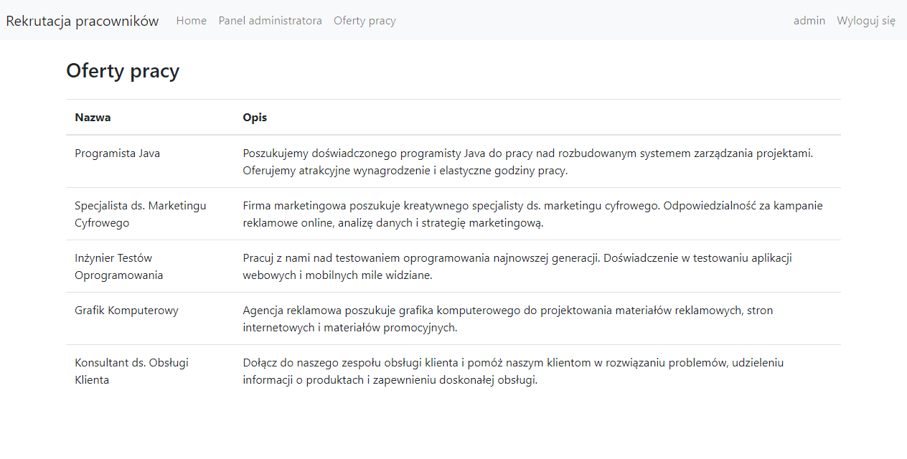

# recruitment-system

Rekrutacja Pracowników is a recruitment management application built with React.js, Spring, and PostgreSQL. It allows recruiters to manage candidates and job listings, including adding, editing, sorting, and deleting entries. Users can register, log in, apply for jobs with attachments, and manage their profiles. Admins have control over user roles, job offers, and system settings via an admin panel. The app ensures data security and provides validation for user inputs.

The tasks that the web application fulfills include:
- Securing data and the application against unauthorized access.
- Providing separate permissions for administrators and candidates.
- Conducting unit and integration testing.
- Offering full functionality that allows adding, modifying, and deleting job offer data.
- Implementing a registration mechanism within the application.

---

User stories:
https://docs.google.com/document/d/114SIXdBXFKqgOiWq2rVUsqF1XfpK0lYdf3MRqXB4-_0/edit

1. ### PostgreSQL
   - Otwórz pgAdmin,
   - zaloguj się (u: ``postgres``, h: ``politechnika``), chyba, że macie inaczej skonfigurowane
   - kliknij na server, PostgreSQL
   - Prawy przycisk na bazie danych, create
   - Utwórz bazę o nazwie "rekrutacjap"
2. ### Backend (localhost:8082)
   - Powinno wyskoczy load po lewej na dole - Maven build/load
   - Prawym na BackendApplication tam gdzie zawsze i run
3. ### Frontend (localhost:3000)
   - zakładka terminal
   - cd f ~wciśnij przycisk tab~,
   - npm install 
   - npm start

Stan na ten moment:

## JIRA

https://lewandowska-app.atlassian.net/jira/software/projects/PZ/boards/1

## Informacje dodatkowe

Przy starcie aplikacji dodaje się administrator 
login: admin
hasło: admin123
