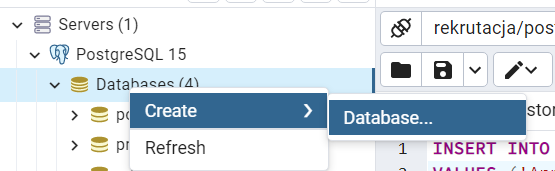
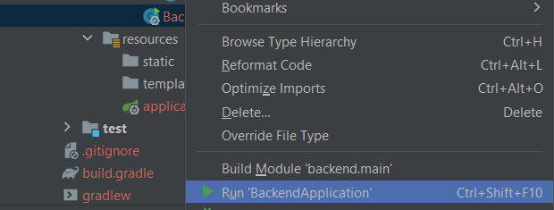
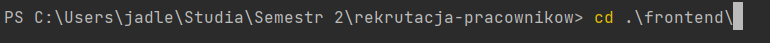
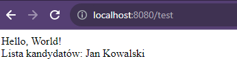
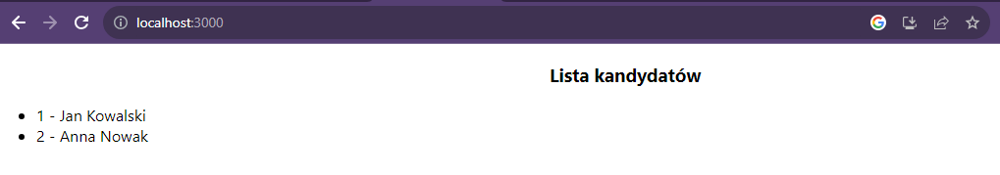

# rekrutacja-pracowników
Aplikacja na przedmiot Programowanie zwinne do rekrutacji pracowników.

---

## Uruchomienie aplikacji

1. POSTGRESQL 
   - Otwórz pgAdmin, 
   - zaloguj się (u: ``postgres``, h: ``politechnika``), chyba, że macie inaczej skonfigurowane
   - kliknij na server, PostgreSQL
   - Prawy przycisk na bazie danych, create:
   
   - Utwórz bazę o nazwie "rekrutacja"
   - Poleceniem scripts, insert zrób zapytanie na przykładowego kandydata, np. ``INSERT INTO candidate (name, surname)
      VALUES ('Jan', 'Kowalski');``
2. BACKEND (localhost:8080)
   - Kliknij prawym klawiszem na build.gradle -> build module
   - Jak nie wyskoczy u góry, to prawym BackendApplication -> run
   
3. FRONTEND (localhost:3000)
    - Otwórz terminal
    - Wpisz ``cd f`` i kliknij przycisk TAB, powinno wyskoczyć:
   
    - Wciśnij enter
    - Wpisz ``npm install`` i ENTER (będzie się dużo działo xd)
    - Wpisz ``npm start`` i ENTER

### Wskazówki :)
Żeby przetestować backend, dodałam w controllerze TEST: http://localhost:8080/test
Powinno wyglądać tak (backend działa z bazą)

Frontend znajduje się tutaj http://localhost:3000/, można zobaczyć czy łączy się z backendem:
